## Introdução

O presente documento visa apresentar a inspeção dos modelos de ***NFR*** (*Non-functional requirements*), trabalho desenvolvido no módulo de Modelagem de Requisitos.

## Objetivo

A inspeção dos modelos de ***NFR Framework*** permite a verificação da aplicação das métricas necessárias para a correta representação do modelo, garantindo ainda uma análise quanto à abrangência, completude e qualidade dos modelos analisados. Um dos focos principais desta inspeção é realizar a verificação da consistência técnica validação através de métricas dos modelos de *NFR Framework* elaborados. Esse conjunto de dados permite descobrir as fraquezas existentes no trabalho e facilita a melhoria da qualidade dos casos de uso nas métricas levantadas como passíveis de melhorias.

## Metodologia

Para a inspeção dos modelos *NFR Framework* será utilizada uma metodologia de avaliação padronizada, em que cada *NFR*, será julgado de acordo com sua não-conformidade com a métrica em análise, ou seja, se a opção “não” for marcada, quer dizer que o modelo *NFR* não está em conformidade com a métrica. Cada métrica está disposta em uma escala de impacto, sendo estes **alto, médio** ou **baixo**. Além disso, também há espaço para a adição de observações pelo avaliador, quando necessário. A inspeção será montada em forma de tabela, sendo cada tabela baseada no checklist geral criado para este documento, em que contém as métricas necessárias para avaliação de um *NFR Framework*.

Após a aplicação da checklist na descrição de uma inspeção de um *NFR* selecionado, será compilada a tabela de medição de inspeção. Em que é compilado um valor que representa de forma quantitativa a qualidade do modelo elaborado, segundo os seguintes critérios:
* A tabela de medição necessita de pesos para os impactos e para essa análise os pesos adotados serão:
 * Peso 1 para métricas com Impacto Baixo;
 * Peso 2 para métricas com Impacto Médio;
 * Peso 3 para métricas com Impacto Alto;
* Com os pesos e as métricas será calculada uma **Taxa de Não Conformidade** que expressa em que nível aquele *NFR* se encontra em desacordo com as métricas estabelecidas;
* O Valor máximo estabelecido para a *Taxa de Não Conformidade* é de **35%**.
* O Resultado de classificação final do modelo analisado é tido como **Aprovado** caso sua *Taxa de Não Conformidade* esteja abaixo de 35% e tido como **Reprovado** caso sua *Taxa de Não Conformidade* seja maior ou igual a 35%.

As métricas utilizadas e a metodologia são elaboradas a partir do estudo “Uma proposta de inspeção em modelos de caso de uso” de Rosângela Gregolin [ [1] ](#referencias). Neste estudo a autora levanta critérios, regras e modelos para a melhor inspeção de casos de uso, tanto em formato de diagrama, quanto sua descrição.

A metodologia possui certas adaptações para melhor adequá-la ao contexto da disciplina, pois não é feito desenvolvimento de protótipos e documentos específicos requisitados pelo modelo.

Para uma melhor avaliação e observações das métricas foram utilizadas referenciais teóricos da IBM que auxiliam na produção de um bom caso de uso e com isso consegue-se visualizar melhor os erros cometidos no caso de uso desenvolvidos no projeto da matéria e elaborar melhores observações a respeito da métrica analisada.

A seguir pode-se conferir os modelos utilizados para a realização da inspeção:

### Checklist

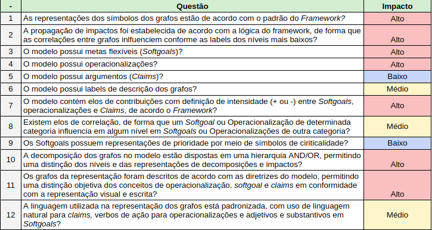

### Registro de Inspeção

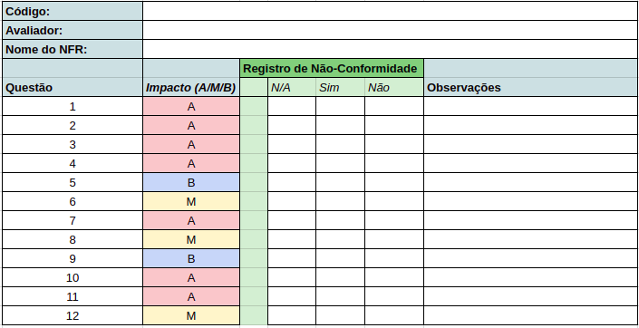

### Tabela de medição

## Inspeções

### Relação de inspeções

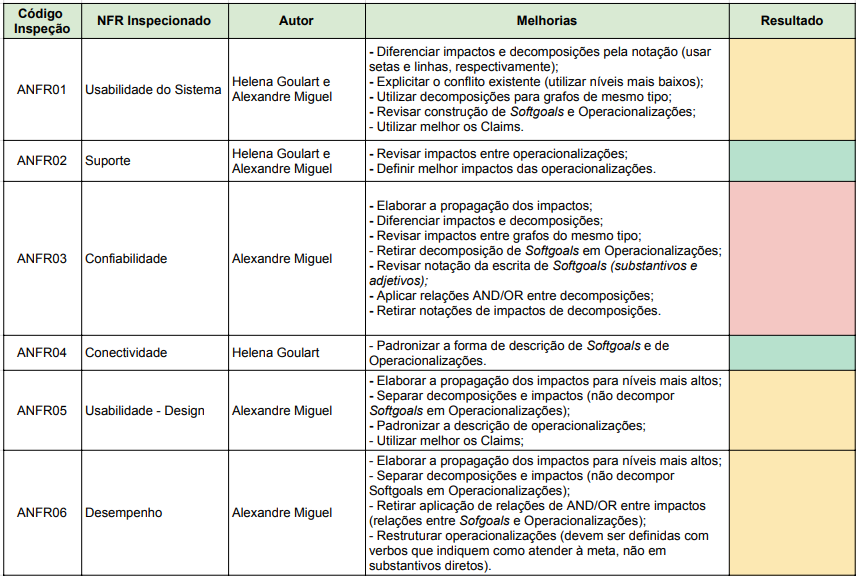

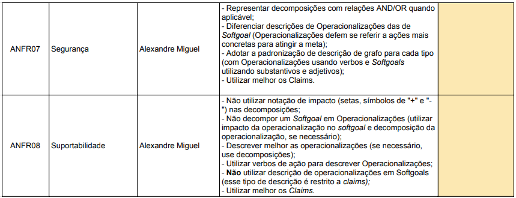

### ANFR-01

Rastreabilidade: [ANFR01 - Usabilidade do Sistema] (nfr.md#usabilidade)

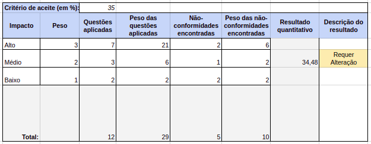

### ANFR-02

Rastreabilidade: [ANFR02 - Suporte] ()

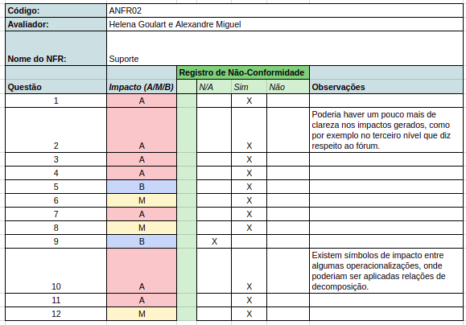

### ANFR-03

Rastreablidade: [ANFRO3 - Confiabilidade]

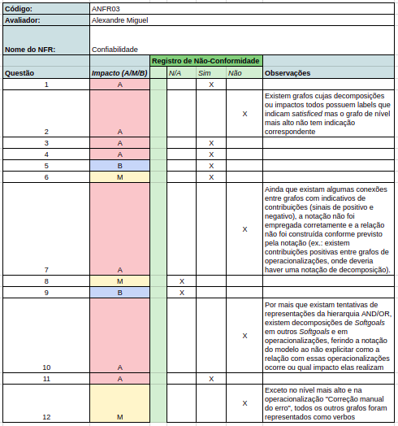

### ANFR-04

Rastreabilidade: [ANFR04 - Conectividade]

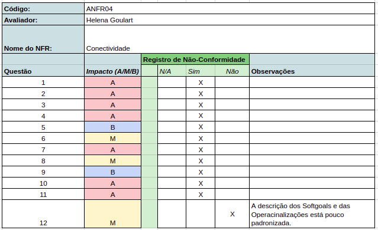

### ANFR-05

Rastreabilidade: [ANFR05 - Usabilidade - Design]

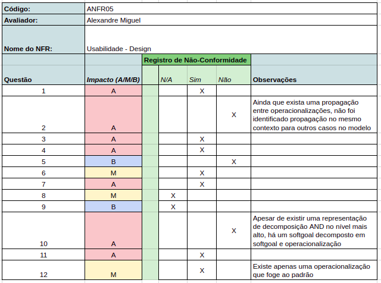

### ANFR-06

Rastreabilidade: [ANFR06 - Desempenho]

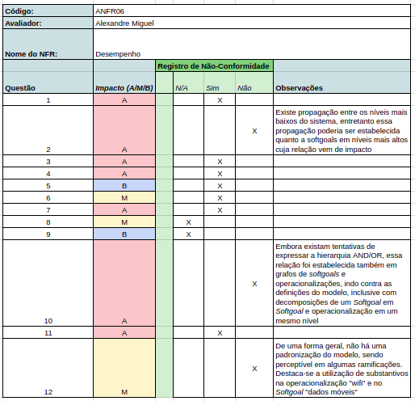

### ANFR-07

Rastreabilidade: [ANFR07 - Segurança]

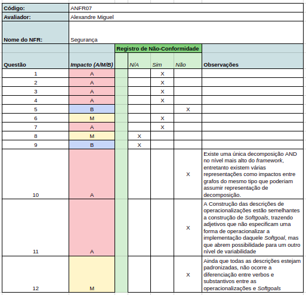

### ANFR-08

Rastreabilidade: [ANFR06 - Segurança

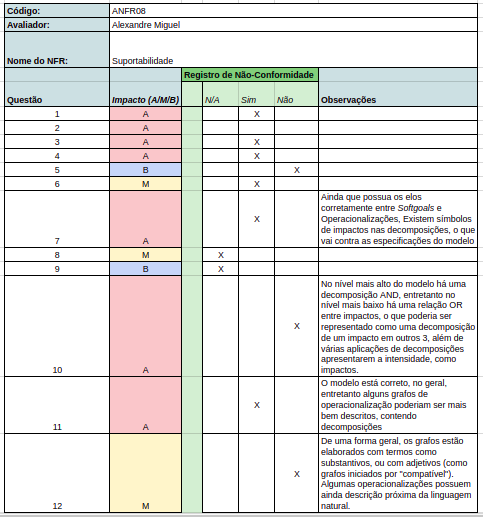

## Resultados

Com a realização da inspeção dos casos de uso foi verificado que todos eles possuem algum ponto em que precisam de melhoria, porém tivemos um resultado de X aprovados e X reprovados dentre os 26 casos de uso feitos pelo grupo no módulo de Modelagem de Requisitos.

## Conclusão

A inspeção dos casos de uso com base nos referenciais teóricos possibilitou a avaliação de métricas essenciais e a identificação de erros. Com as tabelas de inspeção a correção de cada caso de uso será facilitada com os pontos fracos já listados.

## Referências

[1] - PAIM, Fá Rilston Silva; CASTRO, Jaelson. Enhancing Data Warehouse Design with the NFR Framework. Wer, v. 2, p. 40-57, 2002. Disponível em: http://wer.inf.puc-rio.br/WERpapers/pdf_counter.lua?wer=WER02&file_name=paim.pdf

[2] - COUTO, Anselmo; MARTINS, Luiz Eduardo. (2009). Um Processo de Validação de Requisitos Não-Funcionais Baseado no NFR-Framework. Disponível em: https://www.researchgate.net/publication/221235239_Um_Processo_de_Validacao_de_Requisitos_Nao-Funcionais_Baseado_no_NFR-Framework  

[3] - SERRANO, Maurício. Desenvolvimento Intencional de Software Transparente Baseado em Argumentação. 2011. Tese de Doutorado. PUC-Rio. Disponível em: http://www-di.inf.puc-rio.br/~julio/Mauricio.pdf
