# Rastreabilidade

# Introdução

É certo que para encontrar os requisitos de um projeto, além do desenvolvimento das técnicas utilizadas, as discussões apresentam características importantes da equipe: quais decisões foram tomadas, como e porquê. Este arquivo contém toda a rastreabilidade das entregas referente à materia de Requisitos de Software, abrangendo as conversas através do Slack do grupo e até mesmo áudios de conversas gravadas com a autroização da equipe.  

## Rich Picture e Argumentação

O desenvolvimento dessas duas técnicas conteve discussões que desenvolveram-se a princípio sobre os temas a serem abordados na argumentação. Contudo, ainda haviam dúvidas a respeito da pré rastreabilidade do Pinterest, conforme mostram as imagens abaixo:

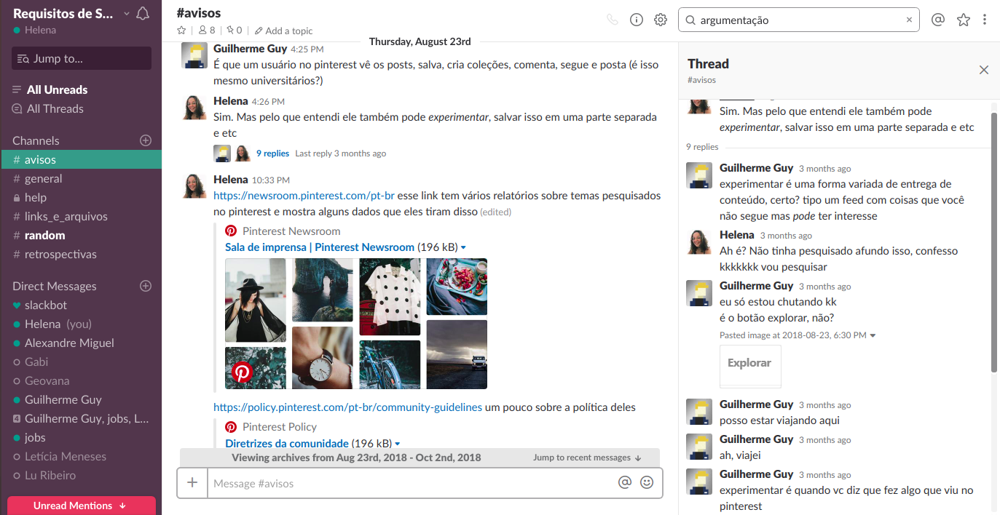

A primeira entrega foi idealizada pelo grupo pessoalmente, e a ata da reunião se encontra abaixo:

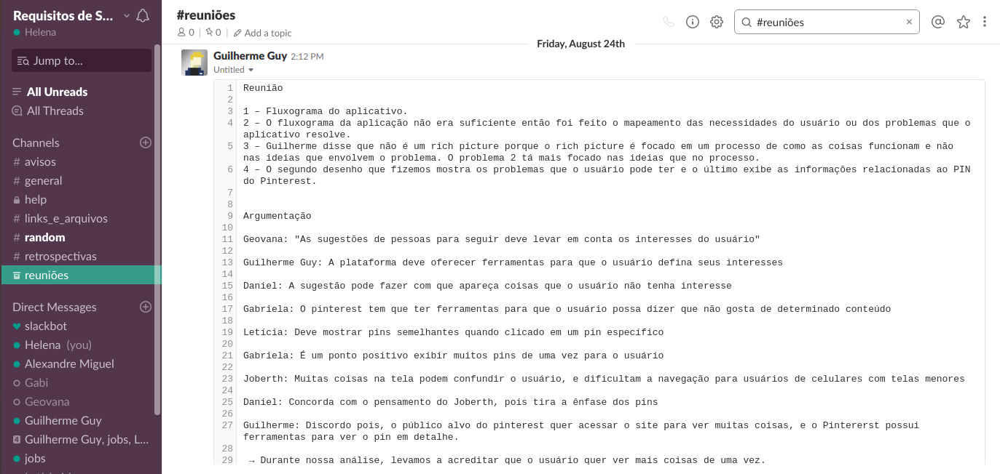

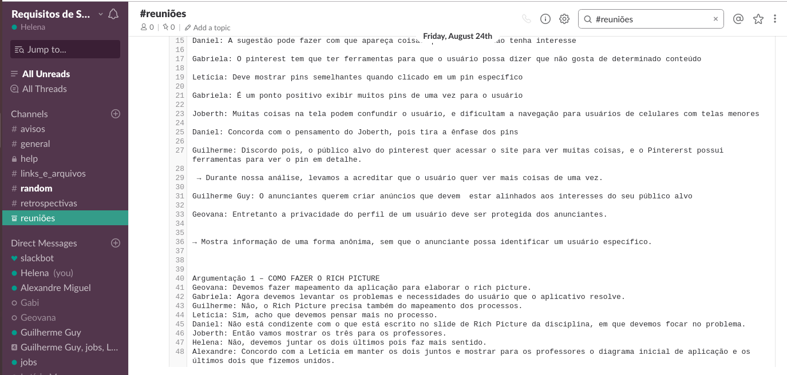

Os feedbacks dados pelos professores para a primeira entega em conjunto foram gravados com a autorização dos mesmos, e podem ser encontrados [clicando aqui](https://drive.google.com/file/d/1j9n-iNVsDRARwqdHPceQfWB_8-kcIFGm/view?usp=sharing). As imagens abaixo mostram os momentos finais em que a equipe fez as alterações no projeto e validou com demais integrantes:

Após a entrega geral da equipe, coube ao grupo a discussão a respeito do desenvolvimento dos Rich Pictures individuais:

Desse modo, foram feitos x [Rich Pictures](rich_picture.md#rich-picture) com os temas [...] e x [Argumentações](argumentacao.md#argumentacao).

## Elicitação de Requisitos

A entrega de elicitação de requisitos envolvia diversas técnicas. Sendo assim, o primeiro ponto a ser levantado foram quais técnicas seriam utilizadas pela equipe. Para entender melhor quais poderiam ser aplicadas, os membros Guilherme, Alexandre e Helena conversaram com o professor Maurício. O resumo da conversa se encontra abaixo:

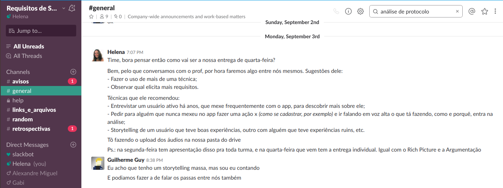

O grupo optou por se reunir na terça-feira (04/09) às 10h da manhã para aplicar algumas das técnicas de elicitação.

## Análise de Protocolo

Na reunião de 04/09 a equipe encontrou um universitário que aceitou participar da análise de protocolo. Os dados da análise foram anotados e se encontram abaixo:

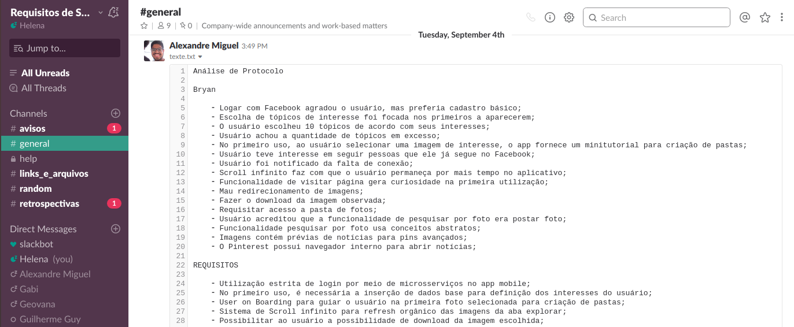

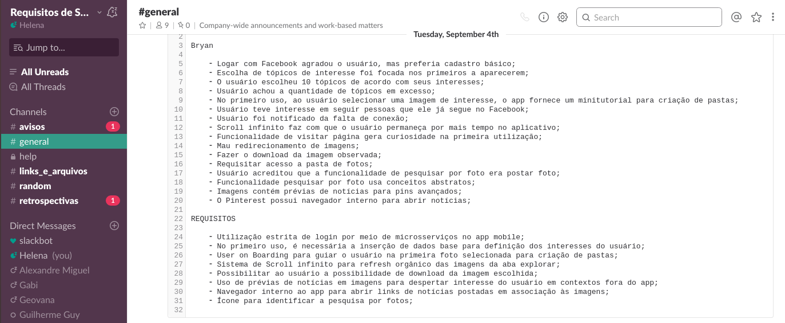

A análise não foi gravada em respeito ao universitário que não se sentiu confortável. Todavia, três membros da equipe (Alexandre, Letícia e Guilherme) anotaram as ações do estudante para que o resultado das anotações fossem feitos de maneira imparcial.

A partir desta [Análise de Protocolo](analise_protocolo.md#analise-de-protocolo-1) foram elicitados 14 requisitos.

HERE: procurar rastros da análise de protocolo do mike

## Análise de Discurso

Em virtude de um consenso do grupo, concluiu-se a importância de realizar um brainstorming de toda a equipe e gravá-lo afim de obter maior detalhamento da conversa. Para guiar a conversa, o membro Guilherme Guy se dispôs a ser um moderador. Para ouvir o áudio completo, basta [clicar aqui](https://drive.google.com/file/d/1VcwwykePY8xA2j7U9DbHl8KZQ-SyajmN/view). A partir dessa conversa, o grupo realizou técnica de [Análise de Discurso](analise_discurso.md#analise-de-discurso) e gerou 14 requisitos elicitados.

## Entrevista

O membro da equipe Alexandre Miguel optou por entrevistar uma estudante de Comunicação Organizacional e usuária do Pinterst, Fernanda Santos, com a intenção de conhecer uma visão técnica a respeito da aplicação. Suas dúvidas se resumiram em quais detalhes deveriam ser colocados na apresentação em sala de aula.

 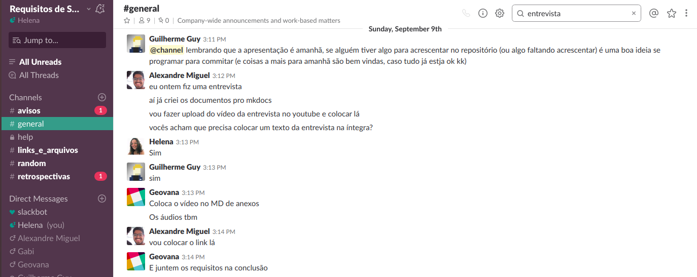

A [Entrevista](entrevista.md#entrevista) possibilitou 15 requisitos elicitados e o vídeo completo com a conversa gravada pode ser encontrado clicando [aqui](https://www.youtube.com/watch?v=1qWvLpRLVLQ).

## Introspecção

A integrante Gabriela optou por fazer uma Introspecção a respeito de uma jovem utilizando o Pinterest apenas para percorrer o conteúdo. A imagem abaixo mostra a primeira versão da técnica sendo aplicada:

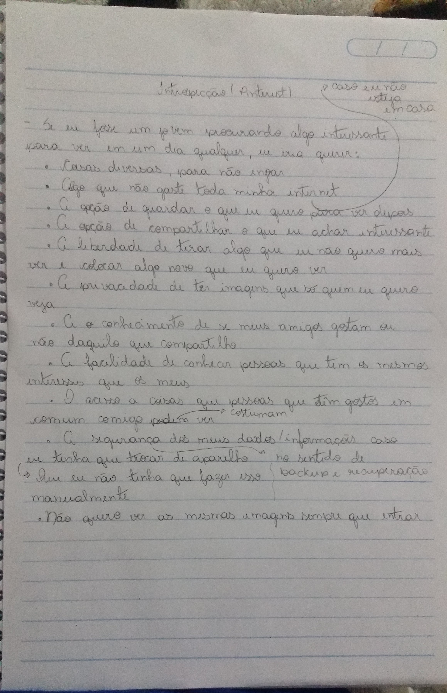

Após ser avaliada pelos professores de Requisitos de Software, o trabalho tornou-se mais específico, identificando quem é o autor em questão, quais são os seus objetivos e as suas necessidades. A [Introspecção](introspeccao.md#introspeccao-1) elicitou 10 requisitos.

HERE: procurar rastros da introspecção da letícia e o mike

## Questionário

A integrante Helena entrou em contato com a monitora Luciana para compreender qual possível técnica que ainda não havia sido aplicada para esta entrega e ainda seria possível de desenvolver, e recebeu o conselho de realizar um Questionário.

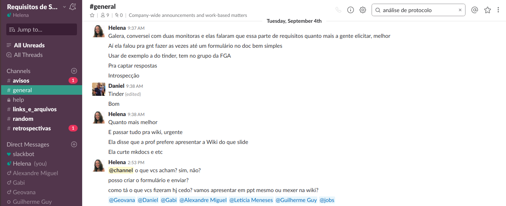

A equipe achou um pouco arriscado, mas a integrante da equipe optou por desenvolver mesmo que desse errado, para compreender quais as técnicas seriam interessantes ou não para ajudar na elicitação de requisitos do Pinterest.

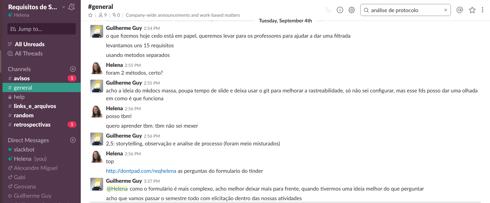

Guilherme Guy sugeriu uma alteração e após a edição final o questionário foi divulgado.

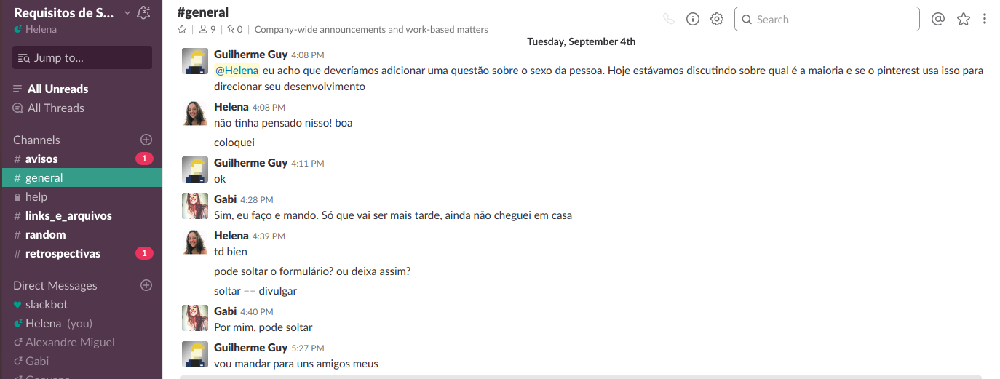

Após conversar com os professores, concluiu-se que as perguntas feitas todavia agregaram pouco em requisitos para o aplicativo, e foram feitas sugestões de um novo questionário que possivelmente poderia ser aplicado posteriormente. Em virtude disso, o [Questionário](questionario.md#questionario) elicitou apenas 5 requisitos.
